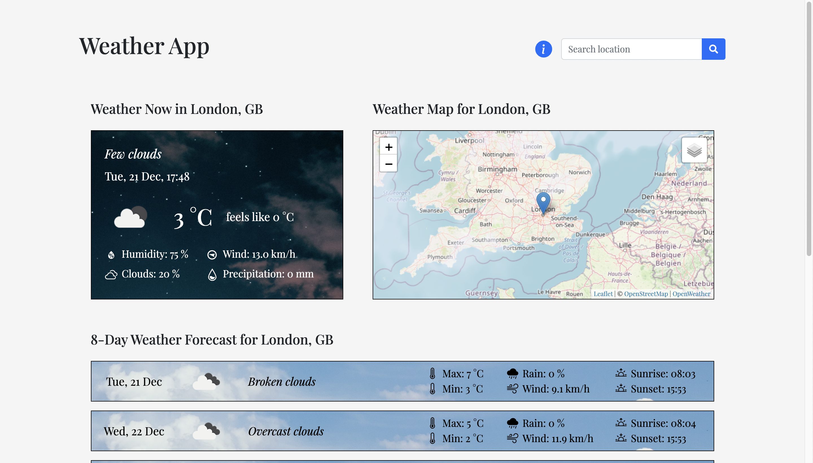

# Weather App
https://victordrumond.github.io/weather-app/

## Technologies
`React` `React-Bootstrap`

## Description
* A responsive weather app built with React & React-Bootstrap.
* Search by location and get current weather data + 8-day weather forecast for over 200,000 cities.
* Weather map: precipitation, temperature, clouds & wind speed layers.
* Icons from [React Icons](https://react-icons.github.io/react-icons/) and [React Font Awesome](https://fontawesome.com/v5.15/how-to-use/on-the-web/using-with/react/).
* Interactive map created with [React Leaflet](https://react-leaflet.js.org/). Layers by [OpenStreetMap](https://www.openstreetmap.org/) & [OpenWeather](https://openweathermap.org/).

## Credits
* Weather API by [OpenWeather](https://openweathermap.org/).
* Images by [Antunes Vila Nova Neto](https://unsplash.com/photos/IUAyoABilaA), [Alex Rodríguez Santibáñez](https://unsplash.com/photos/4_VH2_Vqss4), [Anandu Vinod](https://unsplash.com/photos/pbxwxwfI0B4), [Dan Senior](https://unsplash.com/photos/i7j3v6bHaTk), [Daoudi Aissa](https://unsplash.com/photos/Pe1Ol9oLc4o), [Paul Volkmer](https://unsplash.com/photos/qVotvbsuM_c), [Todd Diemer](https://unsplash.com/photos/67t2GJcD5PI), [William Topa](https://unsplash.com/photos/dG8d8JYnnvA), [Nacho Rochon](https://unsplash.com/photos/CG7YwmRDGvI), [Luc Dobigeon](https://unsplash.com/photos/BdvZQL0iebM), [Uwe Conrad](https://unsplash.com/photos/nAAGfp-jkEQ), [Raychel Sanner](https://unsplash.com/photos/1cJXplTxrmI), [Rodion Kutsaev](https://unsplash.com/photos/PEm_sLmJT-w), [Will Swann](https://unsplash.com/photos/jR5I7mKa1Sw), [Shaylyn](https://unsplash.com/photos/L8V1D2jnJ4M), [Gabriel Tovar](https://unsplash.com/photos/-dfqaTOIFVA) and [Artur Aldyrkhanov](https://unsplash.com/photos/Mw69dJXYDII).

## Screenshot

## Getting Started with Create React App
This project was bootstrapped with [Create React App](https://github.com/facebook/create-react-app).

### Available Scripts
In the project directory, you can run:

`npm start`

Runs the app in the development mode.\
Open [http://localhost:3000](http://localhost:3000) to view it in your browser.

The page will reload when you make changes.\
You may also see any lint errors in the console.

`npm test`

Launches the test runner in the interactive watch mode.\
See the section about [running tests](https://facebook.github.io/create-react-app/docs/running-tests) for more information.

`npm run build`

Builds the app for production to the `build` folder.\
It correctly bundles React in production mode and optimizes the build for the best performance.

The build is minified and the filenames include the hashes.\
Your app is ready to be deployed!

See the section about [deployment](https://facebook.github.io/create-react-app/docs/deployment) for more information.

`npm run eject`

**Note: this is a one-way operation. Once you `eject`, you can't go back!**

If you aren't satisfied with the build tool and configuration choices, you can `eject` at any time. This command will remove the single build dependency from your project.

Instead, it will copy all the configuration files and the transitive dependencies (webpack, Babel, ESLint, etc) right into your project so you have full control over them. All of the commands except `eject` will still work, but they will point to the copied scripts so you can tweak them. At this point you're on your own.

You don't have to ever use `eject`. The curated feature set is suitable for small and middle deployments, and you shouldn't feel obligated to use this feature. However we understand that this tool wouldn't be useful if you couldn't customize it when you are ready for it.